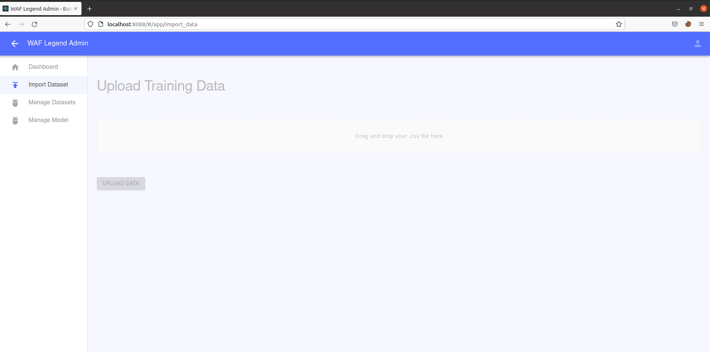
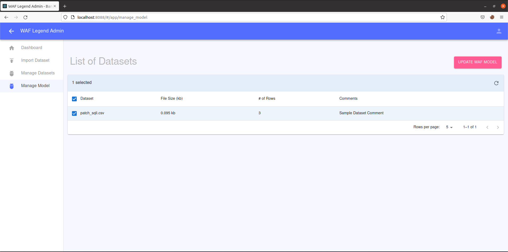
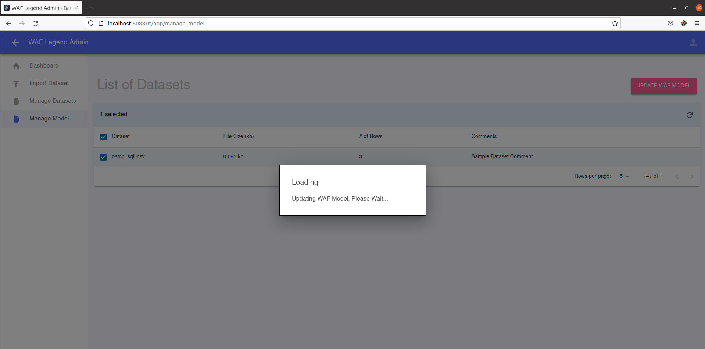
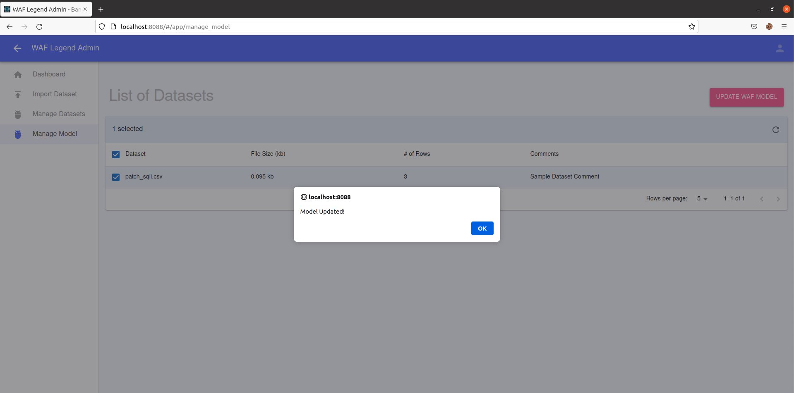

<p align="center">
<br />
   <h1>N3XT-G3N Web App Firewall (NGWAF)</h1>
</p>


1. [The Motivation | What is the N3XT ST3P?](#the-motivation--what-is-the-n3xt-st3p)

   ​	[How does NGWAF work?](#how-does-ngwaf-works)

   ​	[NGWAF's key Considerations](#key-features)

2. [The Components | The Gears of NGWAF](#the-components-of-ngwaf)

   ​	[1. The Brains - Machine-Learning based WAF](#1-the-brains---machine-learning-based-waf--who-needs-manual-when-we-can-go-neural)

   ​	[2. The Looking Glass - Scalable Interactive Quarantine Environment](#2-the-looking-glass---scalable-interactive-quarantine-environment--dont-let-them-go-detain-them)

   ​	[3. The Library - Retraining Sequence to Reinforce the Brains](#3-the-library---retraining-sequence-to-reinforce-the-brains--smart-isnt-really-smart-till-you-can-keep-learning)

3. [Setting up NGWAF](#setting-up-ngwaf--requirements-installation-and-usage)

   ​	[Requirements](#requirements)

   ​	[Installation and Usage](#installation-and-usage)

4. [Disclaimers & Other Considerations](#disclaimers--other-considerations)

5. [Licensing](#licensing)


# The Motivation | What is the N3XT ST3P?

      
With the explosive growth of web applications since the early 2000s, web-based attacks have progressively become more rampant. One common solution is the Web Application Firewall (WAF). However, tweaking rules of current WAFs to improve the detection mechanisms can be complex and difficult. NGWAF seeks to address these drawbacks with a novel machine learning and quarantine-to-honeypot based architecture.

Inspired by actual pain points from operating WAFs, NGWAF intends to simplify and reimagine WAF operations through the following processes: 

| Pain point | NGWAF Feature | 
|---|----|
| Maintenance of detection mechanisms and rules can be complex | Leverage machine learning to automate the process of creating and updating detection mechanisms | 
| Immediate blocking of malicious traffic reduces chances of learning from threat actor behavior for future WAF improvements | Threat elimination through redirected quarantine as opposed to conventional dropping and blocking of malicious traffic | 

To make deployment simple and portable, we have containerised the different components in the architecture using docker and configured them in a docker-compose file. This allows running it on a fresh install to be quick and easy as the dependencies are handled by docker automatically. The deployment can be expanded to be deployed into a local or cloud provider based kubernetes cluster, making scalabe as users can increase the number of nodes/pods to handle large amounts of traffic.

The deployment have been tested on macOS (Docker desktop), linux (ubuntu).

NGWAF is created by [@yupengfei](https://github.com/FA-PengFei), [@zhangbosen](https://github.com/duemaster), [@matthewng](https://github.com/matthewng1996) and [@elizabethlim](https://github.com/elizabeth-dsaid)

Special shoutout to [@ruinahkoh](https://github.com/ruinahkoh) for her contributions to the initial stages of NGWAF.


### How does NGWAF work?

NGWAF runs out-of-the-box with three key components, these components as mentioned above are all containerised and are scalable according to desired usage.
The protected resource can be customised by making a deployment change within the setup.

<p align="center">
  
   </br>
   <i>High level architecture of NGWAF with expected traffic flows from different parties</i>
</p>

### Key Benefits
   
**NGWAF was engineered with the following key user benefits in mind:**

#### **1. Rule Complexity Reduction**
NGWAF replaces traditional rulesets with deep learning models to reduce the complexity of managing and updating rules. Instead of manually editting rules, NGWAF's machine learning automates the pattern learning process from malicious data. Data collected from the quarantine environment are automatically scrubbed and batched, allowing it to be retrained into our detection model if desired.

#### **2. Cyber Deception**

NGWAF adopts a novel architecture consisting an interactive and quarantine environment built to isolate potential hostile attackers. Unlike conventional WAFs which blocks upon detection, NGWAF diverts threat actors to emulated systems, trapping them to soften the impact of their malicious actions. The environment also act as a sinkhole to gather current attack methods, enabling the observation and collection of malicious data. These data can be used to further improve NGWAF's detection capability. 

<p align="center">
  
  <br/>
  <i>NGWAF in action: Upon detection of SQL injection, NGWAF redirects to our quarantine environment, instead of dropping or blocking the attempt.</i>
</p>

#### **3. Compliance to Internationally Recognised Standards**

The guiding principal behind the creation of NGWAF is to guard against the risks highlighted from the Open Web Application Security Project's standard awareness document - [The OWASP Top 10 2021](https://owasp.org/www-project-top-ten/).

Training data and compliance checks for NGWAF are collected and conducted based on this requirement.


# The Components of NGWAF 

### 1. The Brains - Machine-Learning based WAF | Who needs manual when we can go NEURAL

Instead of traditional rulesets which require analysts to manually identify and add rules as time goes by, NGWAF leverages **end-to-end machine learning pipelines** for the detection mechanism, greatly reducing the complexity in WAF rule management, especially for detecting complex payloads.  

#### Base Model
To do so, we needed to first create a base model and architecture that users can start off with, before they later use data collected from their own applications for retraining and fine-tuning:

1. We collected malicious and non-malicious payloads from various application logs (total of ~40k observations)
2. Instead of manually identifying rules, we leverage machine and deep learning to automate the process of learning patterns from previous malicious data. 
3. We then experimented with several model architectures, and our final model utilized a *sequential neural network* to predict whether an incoming payload was malicious or not. 

#### Performance
Our model was able to achieve 99.6% accuracy on our training dataset.

#### Maintenance & Retraining
Although we have included logs from various applications in order to improve the generalizability of the base model, further maintenance and retraining of the model will be important to:

1. Tune the model for better performance on traffic from the user's specific application
2. Reduce model degradation over time, as threat actors discover new methods and opportunities

To address this, users of NGWAF benefit from our packaged end-to-end model retaining pipeline, and can easily trigger model maintenance with a few simple steps without having to dig under the hood. (See [Section 3](#3-the-library---retraining-sequence-to-reinforce-the-brains--smart-isnt-really-smart-till-you-can-keep-learning) below).

### 2. The Looking Glass - Scalable Interactive Quarantine Environment | Don't let them go, DETAIN THEM!

Contrary to traditional WAFs where malicious traffic are blocked or dropped right away. NGWAF is going with a more flexible approach. Whereby, it redirects and detains malicious actors within a quarantine environment. This environment consists of various interactive emulated honeypots to try and gather more attack methods/data, these data will be utilised to potentially enhance NGWAF's detection rate of more modern and complex attacks.

#### Capturing of Malicious data and Auto-Scrubbing for retraining purposes

Currently, NGWAF's quarantine environment forwards all data submitted by the trapped attacker to our ELK stack for analysis and visualisation. 
The data are auto-scrubbed into different components of the HTTP request, then packaged internally on the environment's backend in JSON format before forwarding. 
This helps to lower the manpower cost required to clean and index the data when we kickstart the retraining process.

#### Creating your customised quarantine environment

NGWAF currently provides users to make changes to the look and feel of the **front-end** aspect of our honeypots within the quarantine environment (based off a customised version of drupot). Users simply have to replace the assets folder within the docker volume with their **front-end** assets of choice. 

NGWAF is also accommodating to users who would like to link their own honeypots as part of the quarantine environment. 
Users just have to forward the honeypot's HTTP requests to the environment's backend server (backend processes will automatically scrub and forward data to the analysis dashboard - ELK stack).


### 3. The Library - Retraining Sequence to Reinforce the Brains | Smart isn't really smart till you can keep learning.

As new payloads and attack vectors emerge, it is important to upgrade detection capabilities in order to ensure security. Hence, a retraining function is built into NGWAF to ensure defenders are able to train the machine learning model to detect those newer payloads.

Retraining of datasets is one of the main features in NGWAF. On our dashboard, users can insert new dataset for retraining, to strengthen and improve the quality of NGWAF detection of malicious payloads.

<p align="center">
  
</p>

This can be achieved in the following steps:

1. Create a new dataset (.csv) for upload in the following format (empty column, training data, label). You can refer to `patch_sqli.csv` as an example.

2. Navigate to `http://localhost:8088` to view NGWAF admin panel.

3. Select the "Import Dataset" tab and upload the training set you have created



4. Confirm that the training set have been uploaded successfully under the "Manage Datasets" tab.



5. Under "Manage Model" tab, select the dataset(s) you want to retrain the model on and click on the "UPDATE WAF MODEL" button.




6. Congrats! The model should finish re-training after some time. 



### 4. Additional Features:

NGWAF uses ELK stack to capture logs of network data that passes through NGWAF, allowing users to monitor the traffic that passes through the NGWAF for further analysis.

<p align="center">
  
</p>

NGWAF also comes with live Telegram notification, to inform owners about live malicious threats that is detected by NGWAF.

<p align="center">
  
</p>


### Sample Usage Scenarios
1. Newly normal application (Use the inbuilt web cloner / create another duplicate deployment to use as isolation environment)
2. Integrate into existing honeypot/honeynet (Update the configuration to point to honeypot/honeynet)


## Setting up NGWAF | Requirements, installation, and usage

### Requirements
   
Tested Operating Systems
1. macOS (Docker Desktop)
2. linux
   
   
#### WAF Component
1. Python
2. request
3. fastapi
4. pandas
5. scikit-learn
6. tensorflow (tentative)
7. nltk
   
#### WAF Admin Panel Component
1. fastapi
2. scikit-learn
3. nltk
4. pandas
5. Create React App
6. [React Material Admin Template by Flatlogic](https://github.com/flatlogic/react-material-admin)
   
#### Decode Layer
1. [Cyberchef Server](https://github.com/gchq/CyberChef-server)

#### Caching Layer
1. Redis

####  Quarantine Environment
1. [Drupot](https://github.com/d1str0/drupot)
2. Elastic Search Stack Components (Elasticsearch, Logstash, Kibana, Filebeats)
   
#### Web App
1. [DVWA](https://github.com/digininja/DVWA)
2. [OWASP](https://owasp.org/www-project-juice-shop/)

### Installation and Usage

With Docker running, run the following file using the command below:

`./run.sh`
   
   
To replace the targets, point the `dest_server` and `honey_pot_server` variable to the correct targets in the `/waf/WafApp/waf.py` file
```python
# Replace me
dest_server = "dvwa"
honey_pot_server = "drupot:5000"
```
   

Once the Docker container is up, you can visit your localhost, in which these ports are running these services:
| Port | Service         | Remarks                           | Credentials (If applicable) | 
|------|-----------------|-----------------------------------|-----------------------------|
| 8080 | DVWA            | Where the WAF resides             | admin:password              | 
| 5601 | Elasticsearch   | To view logs                      | elastic:changeme            |   
| 8088 | Admin Dashboard | Dashboard to manage the WAF model |                             |   
| 5001 | Drupot          | Honeypot                          |                             |  

To allow for Telegram live notifications, do replace the following variables in `/waf/WafApp/waf.py` with a valid TELEGRAM tokens.

```python
token='<INSERT VALID TELEGRAM BOT TOKEN>'
CHAT_ID = '<INSERT VALID CHAT_ID>'
WAF_NAME = 'Tester_WAF'
WARN_MSG = "ALERT [Security Incident] Malicious activity detected on " +WAF_NAME+ ". Please alert relevant teams and check through incident artifacts."
URL= "https://api.telegram.org/bot{}/sendMessage?chat_id={}&text={}".format(token,CHAT_ID,WARN_MSG)
```


## Disclaimers & Other Considerations

NGWAF is a W.I.P, Open source project, functions and features may change from patch to patch.
If you are interested to contribute, please feel free to create an issue or pull request!


## Licensing

#### License

[GNU General Public License](/LICENSE) 
