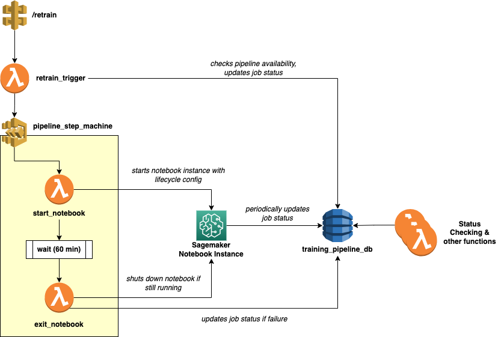

# NGWAF: End-to-end ML WAF 

Note: All lambda function code files are located in the `infra/lambda_functions` folder.

## Setup
Rough order of set-up
1. **S3 Bucket**: Called `ngwaf-sagemaker` in this repo (will need to change since S3 bucket names are unique). Initialize with following 3 directories:
  - `/model` directory: empty
  - `/_tmp_train` directory: empty
  - `/base_model` directory: To copy over our base model files
2. **DynamoDB**: Called `ngwaf-training-pipeline` (don't think need unique so can use as is)
  - Partition key: `job_key`
  - All other settings default
3. **Sagemaker Lifecycle Config**: Create a lifecycle config with the script in `infra/lifecycle_config.sh`
4. **Sagemaker Notebook Instance**: Called `ngwaf-test-v3` in this repo.
  - Attach the lifecycle config from (3)
  - IAM role should have the following access permissions:
    - S3 (List, Read, Write): to both the bucket in (1) and whatever bucket the admin panel uploads to
    - DynamoDB (Read/Query, Write, *need to check*)
    - Sagemaker (Stop Notebook instance, *need to check if anything else*)
5. **Lambda function IAM**: Each of the lambda functions require slightly different permissions, but to keep it simple can just create one IAM role to share across them
  - S3 (List, Read, Write): to both the bucket in (1) and whatever bucket the admin panel uploads to
  - DynamoDB (Read/Query, Write, *need to check*)
  - Sagemaker (essentially need Start/Stop notebook instance, invoke endpoint, *need to check exact combo of policies if not fullAccess*)
  - Step function (should only need `StartExecution`)
6. **Retraining lambda/step function**: The set of lambda and step functions needs to be created in this reverse order due to dependencies (together with the IAM role in (5)):
  - 6a: `exit_notebook` lambda function: needs names of (1) and (4)
  - 6b: `start_notebook` lambda function: needs names of (4)
  - 6c: Step function. Use the script in `infra/step_machine_definition.json` and fill in the ARN for (6a) and (6b)
    - No need to attach specific IAM role for this. They should be able to create a scoped role for you automatically based on the steps you define
  - 6d: `retrain_trigger` lambda function: needs names of (1) and (2) and ARN of (6c) 
7. **Other lambda functions**: These are independent functions that just require the IAM role in (5)
  - `sm_serving` lambda
  - `get_all_job_status` lambda
  - `check_job_status` lambda

**[TO-DO ITEMS / TBD]**
1. Script to check if it is the user's first time initializing the repo/if the endpoint doesn't already exist. If so, then deploy the base model as the first endpoint.
2. Confirm which base model to upload into the S3 bucket
3. Maybe update the lifecycle config script to pull from our repo (when public) to ensure it's always up to date

## 1. Serving
Once the models are deployed as Sagemaker endpoints (which will be done through the [retraining script](#2-retraining-script)), they can be easily deployed through lambda functions, which can be found in `sm_serving`

## 2. Retraining
At a high-level, the retraining pipeline makes use of several AWS Lambda functions, Step function, and Sagemaker notebook instances.

### 2.1 Retrain Trigger

### 2.2 Pipeline Step Machine
This components uses AWS step functions to implement a maximum waiting time before the Sagemaker notebook instance is shut down, in case any errors happen and the notebook does not successfully run to completion. 

A sample definition of the Step function can be found in `infra/step_machine_definition.json`. Note that it will have to be filled in with the ARNs of your specific lambda functions.

The three main steps are:

1. Start the Sagemaker notebook instance (see next section) by triggering the `start_notebook` lambda function
2. Enter a wait state for the time period specified (set to 1 hour)
3. After wait state, check whether the job has successfully completed and notebook instance is shut down. If not, update the job status to "failed" and shut the notebook down. This is handled in the `exit_notebook` lambda function.

### 2.3 Sagemaker notebook instance
There are two key parts of the notebook instance:

#### (2.3.1) Lifecycle config
The lifecycle config is a script that is run whenever the notebook instance is started (i.e. when our `start_notebook` lambda is called). The script can be found in `infra/lifecycle_config.sh`, and it basically instructs instance to immediately run the `train.ipynb` notebook within the repo in the Jupyter. 

#### (2.3.2) Retraining script
Most of the retraining code is contained within `train.ipynb`, with supporting utils and scripts contained within this repo. At a high-level, the train notebook handles the following:

1. **Prepares the data**: Downloads the relevant dataset from S3, splits into train test split, processes the data
2. **Prepares existing models**: Finds and downloads the most recent model to further finetune on
3. **Training**: Launches a Sagemaker training container to build and finetune the new model
4. **Deployment**: Switches out the model deployed on the current live endpoint with the new finetuned model
5. **Logging**: Log intermittent status updates to the dynamo DB, as well as the final model diagnostics when training is complete.
6. **Shutdown**: When all the above steps are completed, shut itself down.

Note that since the notebook is **sequential**, if we run into any errors midway through the notebook the rest of it will not run, and we will not arrive at step 6 where the notebook shuts itself down. This is where the wait state in the pipeline step machine (previous section) is useful for performing a final check. Debugging of what went wrong can be done by checking what was the last intermittent state updated in the dynamo DB job entry.

### 2.4 Status checking
There are additional lambda functions to help with integration into the front-end:

1. `check_job_status`: Given a job key, returns the latest status (e.g. still in training)
2. `get_all_job_status`: Returns a list of all the retraining jobs & their details, for display on the admin dashboard.

## 3. Base Model
*To be filled in*
